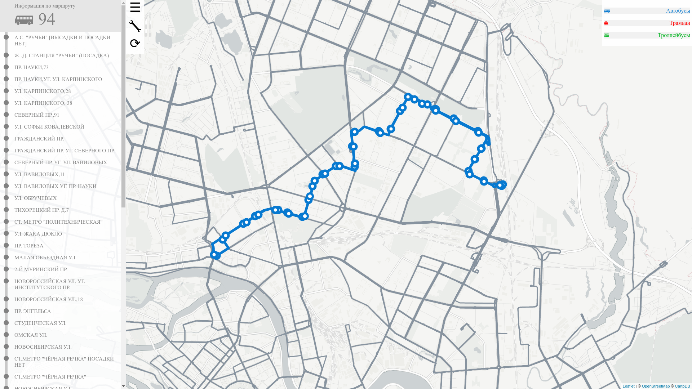

### Проектная работа "Cоздание схем общественного транспорта на основе геоданных"
### НИУ ВШЭ, Факультет компьютерных наук
#### Флоринский Михаил Константинович, 2 курс ПМИ, группа 152

За основу проектной работы взяты маршруты общественного транспорта Санкт-Петербурга.

[Страница с отрисованной картой](https://mflorinsky.github.io/transport-schemes) хостится на github.

### Инструкция по запуску
 
Для начала необходимо клонировать репозиторий и установить `nodejs` и `npm`.

    git clone https://github.com/mflorinsky/transport-schemes
    sudo apt-get update
    sudo apt-get install nodejs
    sudo apt-get install npm
    
Для корректной работы программы потребуются модули `cheerio` и `sphericalmercator`, установить их можно с помощью `npm`.

    cd transport-schemes
    npm install

Для сбора информации и получения файла с данными необходимо запустить `scraper.js`. 
    
    nodejs scraper/scraper.js
    
Результат сгенерируется в `data.json`.
При последующих запусках эта команда будет обновлять данные.

Для просмотра локальной карты нужно запустить сервер:

    npm run dev
    
и перейти по адресу `localhost:8080`  в браузере.

### План

Все планируемые фичи проекта можно разбить на пять категорий, каждая оценена сложностью по шкале от 1 до 5, порядок по приоритету:

* Сбор данных
    * [Open Street Map](http://openstreetmap.ru/)
    * [OverPass](https://overpass-turbo.eu/)
    * [Wikipedia](https://ru.wikipedia.org/wiki/%D0%9E%D0%B1%D1%89%D0%B5%D1%81%D1%82%D0%B2%D0%B5%D0%BD%D0%BD%D1%8B%D0%B9_%D1%82%D1%80%D0%B0%D0%BD%D1%81%D0%BF%D0%BE%D1%80%D1%82_%D0%A1%D0%B0%D0%BD%D0%BA%D1%82-%D0%9F%D0%B5%D1%82%D0%B5%D1%80%D0%B1%D1%83%D1%80%D0%B3%D0%B0)
    * [Официальный сайт города](http://transport.orgp.spb.ru/)
    * [Неофициальные источники](http://pitertransport.com/)
* Дизайн
    * Группировка параллельных маршрутов [1/5]
    * Автоматический подбор приятных и несливающихся цветов линий [1/5]
    * Упрощение линий [2/5]
* Алгоритмы
    * Поиск кратчайшего пути между двумя остановками [1/5]
    * Список станций, до которых можно доехать за заданное время [1/5]
    * Можно прикрутить нейросеть, которая будет определять координаты остановок, максимально совмещая схожесть с реальной картой и дизайнерские решения [5/5]
* Пользователь
    * Отрисовка схемы [3/5]
    * После выбора пункта отправления и пункта назначения выводит список ближайших рейсов [2/5]
    * Краткая информация о каждой остановке по запросу [2/5]
    * Текущие тарифы на проезд [3/5]
    * Последние актуальные новости о станциях [3/5]
    * Мобильная версия приложения на платформе Android [5/5]
* Особое
    * Ближайшие к остановке достопримечательности, книжные магазины и прочее по запросу [3/5]
    * Отображение положения транспорта в реальном времени [4/5]
    * Посмотреть, как схема выглядела бы в прошлом [5/5]
    
### Реализованная функциональность

* Подсветка линий при наведении курсора, зависимость цвета линии от типа транспорта.
* Визуальная составляющая страницы: скрываемое меню с настройками и информацией.

* Возможность просмотра информации об остановках в маршруте по клику.
* При выборе остановки в меню она попадает в фокус.

* При нажатии на остановку показываются все маршруты, содержащие эту остановку.
* Выборочная отрисовка слоев карты: остановки и дороги.

* Геометрическая кластеризация остановок с выбором расстояния и способа подсчета кластеров.
* Просмотр информации о содержащихся в кластере остановках.

### Используемые технологии

Реализован проект в виде web-приложения, при помощи связки html + css + js. В нашем случае это важно, так как нас интересует не только backend, но и frontend. Также используется NodeJS - серверная реализация JavaScript. Многие библиотеки оттуда значительно упрощали работу.
Для сбора информации о маршрутах и станциях Санкт-Петербурга
я остановился на [государственном сайте](http://transport.orgp.spb.ru) города.

### Архитектура проекта

#### Сбор данных

При открытии любого маршрута на сайте для сбора, в разделе XHR находится JSON-файл, содержащий всю необходимую информацию.
Единственный его недостаток в том, что маршрут сочетает в себе соединенные прямой и обратный.
Пометки о направлении отсутствуют и сложно определить, где заканчивается прямой маршрут и начинается обратный.

На этой же странице присутствует таблица с остановками, где они разделяются на две части. Доступа к таблице
через HTML нет - она подгружается извне. Помогает ссылка на расписание - там таблица уже отслеживается.
Достаточно извлечь с этой страницы длины прямого и обратного маршрутов. 

Нахождение списка id маршрутов не составляет труда. 
Для корректого сбора используется метод POST. Аналогично собираются id остановок.

Скрипт `scraper.js` является "стартовой кнопкой" сбора данных и запускает скрипт `getIdList.js`.
Этот скрипт обращается к сайту и получает список id маршрутов, id остановок и длин маршрутов, записывая их в json-файлы в директории `scraper/lists`.
После этого запускается скрипт `getRoute.js`, который собирает основную информацию о маршрутах, сохраняя все в директорию `scraper/route_data`.
Наконец, имеющиеся данные представляются в нужном формате при помощи `format.js` и записываются в `data.json`.

#### Визуализация данных

Собранные координаты остановок были проекцией веб-меркатора EPSG 3857.
Для корректного местоположения на карте они переводятся в градусы.

Для отображения карты была использована библиотека leaflet.
Остановки соединены точными кривыми линиями - используется собранная информация о shape.
Автобусные маршруты обозначены синим цветом, трамвайные - красным, троллейбусные - зеленым.

На карте появились остановки без дорог - вероятно, эти остановки еще не были задействованы в маршрутах на сайте, с которого собиралась информация.
На прочих ресурсах эти остановки аналогично не используются, но присутствуют в общих данных.
В их отображении нет надобности.
Для их фильтрации в данные к каждой остановке добавляется статус, зависящий от наличия маршрутов, проходящих через эту остановку.
Ключевой структурой является объект `onMap`: он содержит в себе нарисованные сейчас остановки и слои.
При помощи этого объекта осуществляются все действия с элементами на карте.
Объект `colorScheme` является "палитрой" карты и содержит все цвета, необходимые для раскрашивания остановок и маршрутов.

Функция `clusterisation` содержит в себе две реализации кластеризации остановок, основанной на евклидовом расстоянии в метрах.
Первая - наивная: итерируемся по массиву остановок и для каждой ищем остановки, находящиеся ближе, чем заданное значение D, на основании чего формируем кластеры.
Вторая - более продвинутая и наглядная - расстояние D характеризует окружность вокруг каждой остановки, и окружность при пересечении  остановки не из своего кластера сливается с окружностями пересеченного кластера, накапливая объем.
Алгоритм таков: рисуем вокруг каждой остановки круг радиусом D. Изначально каждая остановка содержится ровно в одном кластере, совпадая с его центром.
Начинаем пересчитывать: если круг пересек остановку, то объединяем кластеры, пересчитываем центр и радиус круга как расстояние от центра кластера до дальней остановки в кластере + D.
Пересечения ищем до тех пор, пока их не останется - при нахождении нового выполняем пересчет и начинаем поиски с начала.

### Важность и актуальность проекта

Проблема визуализации маршрутов общественного транспорта является актуальной в наши дни:  крупные города имеют развитую транспортную инфраструктуру и каждый из них требует схему своих маршрутов.
Большинство схем делаются вручную: некоторые выполнены профессиональными дизайнерами, а некоторые изображены как есть, без художественных допущений и дизайнерских решений, чаще руководствуясь наложением на карту.

Дизайнерские схемы выглядят великолепно, но требуют огромных затрат сил и времени. К примеру, внимания заслуживает схема Московского метрополитена, процесс создания которой [описывается](https://www.artlebedev.ru/metro/map3/) на сайте студии Артемия Лебедева. 

Поражает внимание к мелким деталям, из которых и складывается красота карты.

Схемы, наложенные на карту, не требуют таких затрат, но имеют существенные недостатки:

* нагромождение параллельных маршрутов

* неграмотно подобранная палитра цветов

* запутанность линий в местах их скопления

* много как лишнего текста, так и неиспользованных пустот

Как результат, в них очень сложно разобраться простому пассажиру и выглядят они сложными и непонятными. Данная проблема [рассматривается](http://artgorbunov.ru/bb/soviet/20160105/) в цикле статей Ильи Бирмана.

Возвращаясь к рассматриваемому нами городу, схема трамвайных маршрутов в Санкт-Петербурге выглядит так:

Эту схему хочется упростить.

Автоматизация данного процесса значительно улучшит качество и простоту схем, сократив расходы на их разработку. В итоге получатся минималистичные и содержательные схемы, не уступающие ведущим дизайнерским.

### Заключение

В результате я остался доволен проектом и тем, что удалось реализовать.
В ходе проекта я приобрел навыки работы с JavaScript, научился сбору данных и работе с ними.
Полученные знания помогут мне в разработке веб-приложений и в понимании того, как работать с фронтендом.

Источники:
* https://www.artlebedev.ru/metro/map3/
* http://artgorbunov.ru/bb/soviet/20160105/
* http://img.tourister.ru/files/8/7/4/8/9/0/1/original.gif
* http://rss-novini.net/images/stories/polezno/varna-karta.jpg
* http://u.rybinskcity.ru/c/images/pages/map_transport.jpg
* https://s-media-cache-ak0.pinimg.com/originals/e0/93/f0/e093f0ea46010e61ed87547df77b0db3.gif
* http://transport.orgp.spb.ru/
* http://pitertransport.com/

